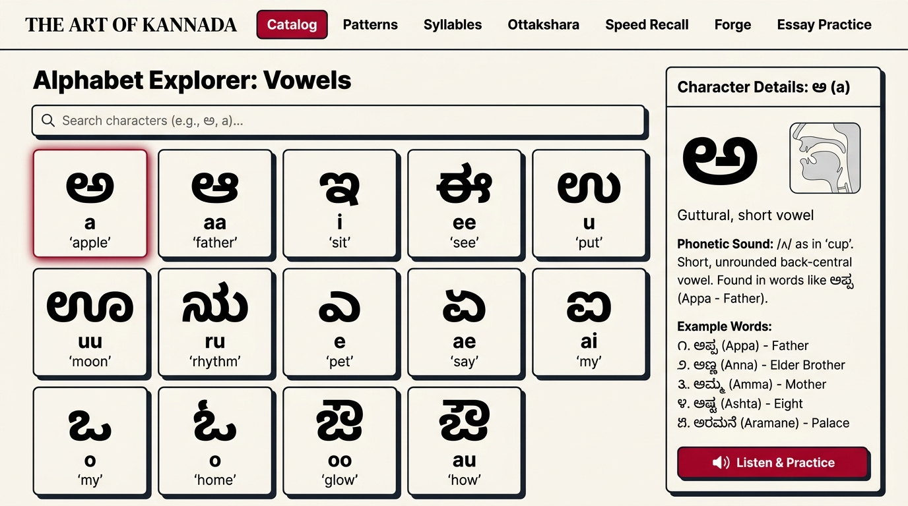
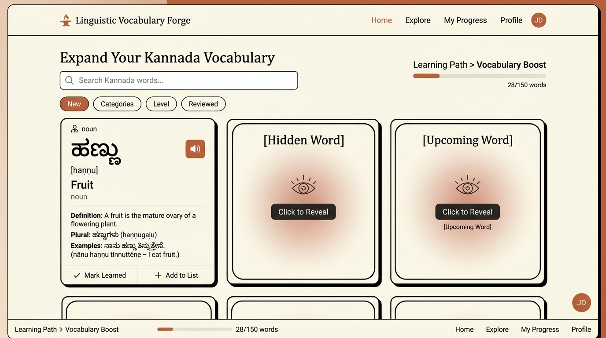

# Kannada Aksharamale & Kagunitha Learner

An interactive, high-fidelity, and culturally tailored full-stack web application designed to help students and enthusiasts master the Kannada script, sounds, vocabulary, and composition.

---

## 📸 Application Showcase

Below are actual screenshots showcasing the warm, academic, and modern neobrutalist interface of our Kannada learning environment:

### 1. Alphabet Explorer & Articulation Commentary
The **Alphabet Explorer** provides a detailed visual catalog of Kannada vowels, consonants, modifiers, and digits, paired with vocal articulation descriptions, letter metrics, and real-world audio examples.


### 2. KAGUNITHA SYLLABLE CHART (Classroom Wall Poster Mode)
A dedicated, high-density print-ready syllable grid with horizontal scrollbars for seamless table navigation showing consonant-vowel combinations and vowel sign diacritics.


### 3. Linguistic Vocabulary Forge (Study Cards Mode)
A vocabulary study deck with search controls, shuffle, filters, and flashcards supporting click-to-reveal translation and native pronunciation.



---

## 🌟 Core Features

The application is structured into modular sections designed to facilitate structured linguistic progression:

1. **Alphabet Catalog (ವರ್ಣಮಾಲೆ)**
   - Interactive grids for Vowels (ಸ್ವರಗಳು), Consonants (ವ್ಯಂಜನಗಳು), and Yogavahakas (ಯೋಗವಾಹಕಗಳು).
   - Instant native pronunciation playback powered by high-quality Web Speech synthesis (`kn-IN`).
   - Detailed visual guidelines, stroke styles, and pronunciation hints.

2. **Sound Pattern Matcher (ಸ್ವರ-ಪैटर्न)**
   - Interactive, visual breakdown of how consonant bases merge with vowel signs (Kagunitha symbols).
   - High-contrast visual mapping showing the addition of vowel-ends like `-a`, `-aa`, `-i`, `-ee`, etc.

3. **Kagunitha Syllable Grid (ಕಾಗುಣಿತ)**
   - Full syllable generation tables displaying consonant-vowel combinations.
   - **Standalone Poster Mode**: A dedicated print-ready high-density dashboard. Includes robust horizontal scrollbars (`overflow-x-auto scrollbar-thin`) to seamlessly navigate dense tables on compact displays.

4. **Ottakshara Learner (ಓತ್ತಕ್ಷರ)**
   - Mastery module for conjunct consonants (subscript letters) representing half-sounds.
   - Interactive search and categorization (Sajateeya vs. Vijateeya conjunct types) with visual audio associations.

5. **Speed Recall Game (ಶೀಘ್ರ ಸ್ಮರಣೆ)**
   - Fast-paced gamified drill designed to test rapid translation associations.
   - Live timers, score progression, and responsive visual feedback loops.

6. **Vocabulary Forge (ಕನ್ನಡ ಫೋರ್ಜ್)**
   - Curated list of 50 highly realistic dictionary words and conversational sentences.
   - Zero artificial, synthesized, or repetitive phrases.
   - Generates 25 randomized, unique entries per shuffle to provide natural exposure to the language.
   - **Study Flashcard Mode**: Hide and reveal details on tap/click to facilitate self-quizzing.

7. **Essay Practice (ನಿಬಂಧ ಅಭ್ಯಾಸ)**
   - Read and practice complex articles in Kannada with parallel English or Hindi explanations.
   - **Instant Loading Optimization**: Avoids repetitive Gemini AI API calls by securely caching up to 5 previously generated articles inside the browser's `localStorage`.

---

## 🛠️ Technology Stack

- **Frontend**: React 19, TypeScript, Vite, Tailwind CSS (v4), Motion (Framer Motion)
- **Backend**: Express, Node.js
- **AI Integration**: Gemini Developer API (`@google/genai`)
- **UI Components**: Lucide Icons, clean hand-crafted Neobrutalist-academic aesthetic

---

## 🚀 Running the App

### 1. Set Up Environment Variables
Create a `.env` file at the root:
```env
GEMINI_API_KEY=your_gemini_api_key_here
```

### 2. Install Dependencies
```bash
npm install
```

### 3. Start Development Server
```bash
npm run dev
```
The app will run locally at `http://localhost:3000`.

### 4. Build for Production
```bash
npm run build
npm start
```
